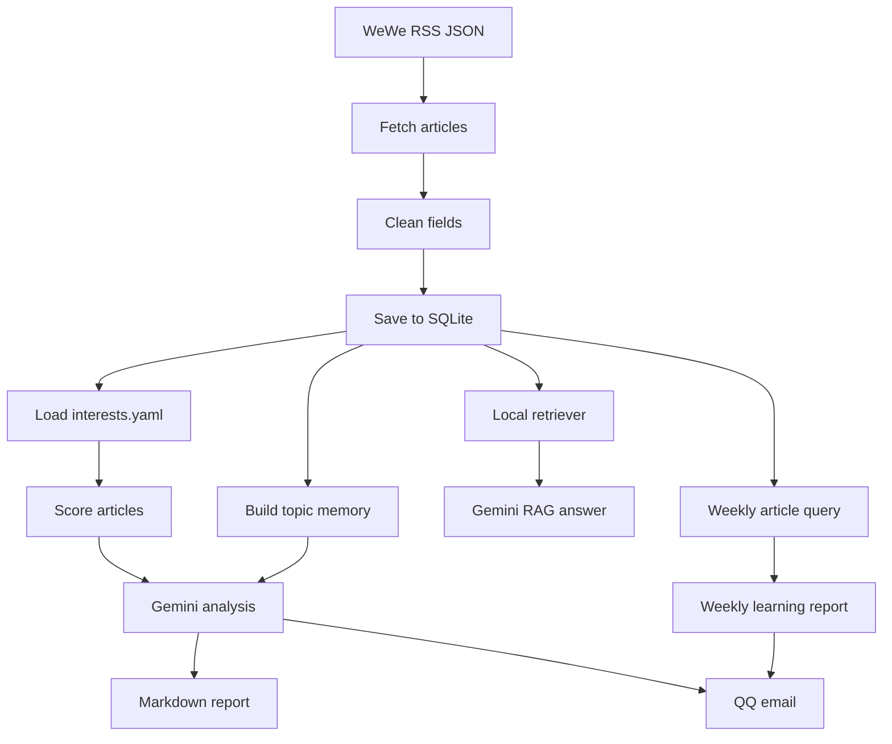

# WeChat Intelligence Agent

WeChat Intelligence Agent 是一个用于处理微信公众号信息流的个人情报工具。它从 WeWe RSS 获取微信公众号文章，保存到本地 SQLite 数据库，然后根据用户兴趣进行筛选、打分、生成 Gemini 简报，并可通过 QQ 邮箱发送分析结果。

项目还提供历史文章问答和每周学习周报功能：用户可以对已保存的文章提问，也可以让程序每周定点分析本周新增的公众号内容。

## 数据源说明

本项目不直接登录微信，也不负责微信公众号订阅源生成。微信公众号 RSS 数据由第三方开源项目 WeWe RSS 提供：

- WeWe RSS GitHub: [cooderl/wewe-rss](https://github.com/cooderl/wewe-rss)
- Docker 镜像示例: [cooderl/wewe-rss-sqlite](https://hub.docker.com/r/cooderl/wewe-rss-sqlite)

WeWe RSS 可以把微信公众号内容转换为 RSS / Atom / JSON 订阅源。本项目默认读取它的 JSON 接口：

```env
WEWE_RSS_JSON_URL=http://127.0.0.1:4000/feeds/all.json
```

如果你的 WeWe RSS 端口、域名或接口路径不同，请在 `.env` 中修改这个地址。

## 功能

- 从 WeWe RSS JSON 接口抓取公众号文章
- 清洗标题、作者、摘要等字段
- 使用 SQLite 保存文章，并自动跳过重复文章
- 通过 `interests.yaml` 配置关注方向和忽略方向
- 根据兴趣规则给文章打分并贴标签
- 统计历史文章中的高频主题
- 调用 Gemini 生成情报简报
- 生成 Markdown 报告
- 使用 QQ SMTP 发送邮件
- 支持重新分析已有文章
- 支持每周定点生成学习周报
- 支持对历史文章进行 RAG 问答

## 项目结构

```text
wechat-intelligence-agent/
├── main.py
├── config.py
├── requirements.txt
├── .env.example
├── .gitignore
├── interests.yaml
├── app/
│   ├── __init__.py
│   ├── rss_fetcher.py
│   ├── cleaner.py
│   ├── database.py
│   ├── profile.py
│   ├── scorer.py
│   ├── memory.py
│   ├── ai_analyzer.py
│   ├── retriever.py
│   ├── rag_qa.py
│   ├── report_generator.py
│   └── email_sender.py
└── screenshots/
    └── README.md
```

## 工作流程



## 安装

建议使用 Python 3.10 或以上版本。

```bash
pip install -r requirements.txt
```

依赖列表：

```text
requests
beautifulsoup4
google-genai
python-dotenv
```

## 配置

复制环境变量模板：

```bash
copy .env.example .env
```

Linux / macOS 可以使用：

```bash
cp .env.example .env
```

然后编辑 `.env`：

```env
WEWE_RSS_JSON_URL=http://127.0.0.1:4000/feeds/all.json

GEMINI_API_KEY=your_gemini_api_key_here
GEMINI_MODEL_NAME=gemini-3.5-flash

EMAIL_HOST=smtp.qq.com
EMAIL_PORT=465
EMAIL_USER=your_email@qq.com
EMAIL_PASSWORD=your_email_auth_code
EMAIL_TO=target_email@qq.com

DATABASE_PATH=data/wechat_agent.db
REPORTS_DIR=reports
FETCH_INTERVAL_MINUTES=60
MAX_ITEMS_PER_RUN=30
SEND_EMAIL=true

WEEKLY_REPORT_DAY=6
WEEKLY_REPORT_TIME=20:00
WEEKLY_LOOP_POLL_SECONDS=60
```

说明：

- `GEMINI_API_KEY`：Gemini API Key。
- `EMAIL_USER`：发件 QQ 邮箱。
- `EMAIL_PASSWORD`：QQ 邮箱 SMTP 授权码，不是 QQ 登录密码。
- `EMAIL_TO`：收件邮箱。
- `SEND_EMAIL=false` 时只生成本地报告，不发送邮件。
- `WEEKLY_REPORT_DAY` 使用 Python 星期编号：`0` 是周一，`6` 是周日。
- `WEEKLY_REPORT_TIME` 是每周自动生成周报的时间。

## 配置兴趣画像

编辑 `interests.yaml`：

```yaml
interests:
  - AI Agent
  - 医疗大数据
  - 生物统计
  - 医学机器学习
  - 疾病风险评估
  - 多标签学习

avoid:
  - 会议通知
  - 纯通知
  - 招生宣传
  - 节日祝福

focus_questions:
  - 哪些文章值得今天立即阅读？
  - 哪些内容可以转化成项目、论文或自动化工具？
  - 哪些主题正在反复出现，值得长期追踪？
```

程序会根据这些配置给文章打分，并在 Gemini 分析时把这些偏好作为上下文。

## 使用方法

### 运行一次

```bash
python main.py
```

程序会执行：

1. 从 WeWe RSS 抓取文章
2. 清洗并写入 SQLite
3. 对新增文章打分
4. 调用 Gemini 生成简报
5. 生成 Markdown 报告
6. 如果开启邮件配置，则发送 QQ 邮件

### 持续运行

```bash
python main.py --loop
```

运行间隔由 `.env` 中的 `FETCH_INTERVAL_MINUTES` 控制。

### 重新分析已有文章

如果本次没有新增文章，但希望测试分析和邮件发送：

```bash
python main.py --analyze-existing
```

程序会从数据库中读取最近 `MAX_ITEMS_PER_RUN` 篇文章，重新生成分析结果。

### 生成本周学习周报

立即生成一次本周学习周报：

```bash
python main.py --weekly
```

程序会先抓取一次最新 RSS，把新文章入库，然后读取本周新入库的文章，生成“本周公众号学习周报”。

如果本周已经生成过，但需要重新生成：

```bash
python main.py --weekly --force
```

### 每周定点自动生成周报

根据 `.env` 中的配置持续运行：

```bash
python main.py --weekly-loop
```

示例配置：

```env
WEEKLY_REPORT_DAY=6
WEEKLY_REPORT_TIME=20:00
WEEKLY_LOOP_POLL_SECONDS=60
```

含义：

- `WEEKLY_REPORT_DAY=6`：每周日。
- `WEEKLY_REPORT_TIME=20:00`：晚上 8 点。
- `WEEKLY_LOOP_POLL_SECONDS=60`：每 60 秒检查一次是否到达执行时间。

程序会在 SQLite 中记录每周任务运行情况，避免同一周重复发送。

### 历史文章问答

对已经保存的文章提问：

```bash
python main.py --ask "过去文章里多标签学习有哪些医学应用场景？"
```

指定检索文章数量：

```bash
python main.py --ask "哪些内容适合发展成医学机器学习论文选题？" --top-k 8
```

当前检索模块使用本地 TF-IDF + 余弦相似度实现。它不需要额外下载向量模型，适合轻量运行。后续可以替换为 embedding + FAISS / Chroma。

## 输出文件

运行后会生成：

```text
data/wechat_agent.db
reports/wechat-report-*.md
```

这些文件是本地运行产物，不建议上传到 GitHub。

## 邮件效果

日常简报通常包括：

```text
1. 今日是否值得关注
2. 最值得阅读的文章
3. 可以跳过的通知类内容
4. 历史主题趋势
5. 建议行动
```

周报通常包括：

```text
1. 本周学习总览
2. 本周最值得精读的文章
3. 本周主题地图
4. 可以跳过的内容
5. 下周学习计划
6. 可沉淀资产
```

## 截图

可以把运行截图放在 `screenshots/` 目录。建议截图包括：

- 邮件简报截图
- 周报邮件截图
- RAG 问答终端截图
- Markdown 报告截图

截图前请遮挡邮箱、API Key、授权码等敏感信息。

## Roadmap

- 抓取完整微信公众号正文，而不仅依赖 RSS 摘要
- 将正文切分为 chunks
- 引入 embedding 向量检索
- 接入 FAISS 或 Chroma
- 增加 FastAPI 接口
- 增加 Web Dashboard
- 增加用户反馈按钮，例如“有用 / 无用 / 收藏 / 忽略”
- 增加定时任务状态记录和失败重试
- 支持更多数据源，例如网页、PDF、arXiv、GitHub Trending

## 安全提醒

请不要上传：

- `.env`
- `data/`
- `reports/`
- Gemini API Key
- QQ 邮箱 SMTP 授权码
- 本地数据库

仓库中只应该保留 `.env.example` 作为配置模板。

